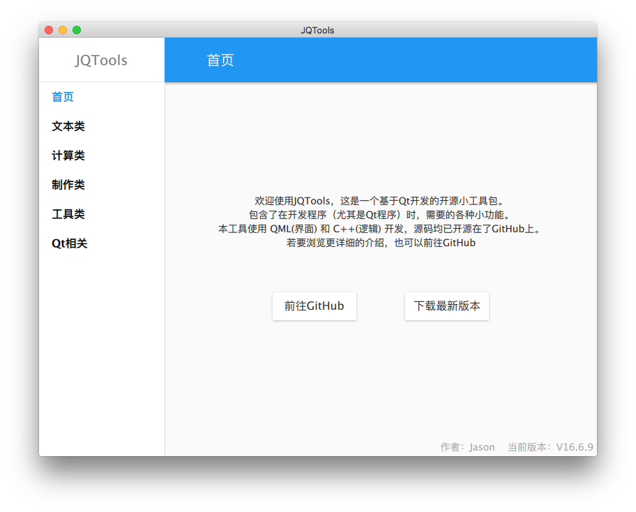

# JQTools

[中文](./README.md) | [English](./README.en.md)

JQTools (Jason Qt Tools) is an open-source utility collection built with Qt, QML, and C++, focused on high-frequency tasks in daily development workflows.

- GitHub: https://github.com/188080501/JQTools
- Latest release: https://github.com/188080501/JQTools/releases/latest
- Issues & feature requests: https://github.com/188080501/JQTools/issues

## Project Status (2026)

The project is currently under refactoring and upgrades.

- The project started in 2016 and is currently in a "10-year version" refactor stage.
- Last stable version before refactoring: [V26.2.14](https://github.com/188080501/JQTools/releases/tag/V26.2.14)
- New features and refactoring are first developed in the `develop` branch, then merged into `master` after stabilization.

## UI Preview



## Features

### Text

- UTF16 Converter  
  Convert between plain strings and UTF-16 escaped strings, for example `"中文"` and `"\u4E2D\u6587"`.

- RGB to Hex  
  Convert between RGB values and HEX color strings (for example `"#112233"`).

- Case Converter  
  Convert text to uppercase or lowercase.

- Random Password Generator  
  Generate random password strings, for example `"Hau-eqS-5EC-"`.

- Random UUID Generator  
  Generate random UUID strings, for example `"bff98ea4-b861-422a-8627-6eb6cbca8716"`.

- URL Encode/Decode  
  Convert between plain text and URL-encoded text, for example `"中文"` and `"%E4%B8%AD%E6%96%87"`.

- JSON Formatter  
  Format JSON content, with optional minified or pretty-printed output.

- String Sorter  
  Sort lines in text content in ascending or descending order.

### Calculation

- Hash Calculator  
  Calculate common hash values such as SHA1 and MD5.

- File Hash Calculator  
  Select a single file and calculate MD5, SHA1, and SHA256 hashes.

- Unix Timestamp Converter  
  Convert between Unix timestamps and date/time.

- Binary Search Assistant  
  Use binary search to find a value in a sorted array.

- RSA Key Generator  
  Generate RSA public/private keys (PEM format), with selectable common key sizes.

- RSA Encrypt/Decrypt  
  Support RSA public-key encryption (Base64 output) and private-key decryption (Base64 input).

- AES Encrypt/Decrypt & HMAC  
  Support AES-CBC encryption/decryption (Base64 I/O, PKCS#7 padding) and HMAC-SHA256 calculation.

### Image

- Icon Generator  
  Generate app icon images in target resolutions from PNG/JPG/JPEG/BMP input, for example `icon_128x128@2x.png` for macOS.

- Icon Font to PNG  
  Convert built-in TTF icon fonts to PNG. Currently includes 8763 available icons.

- PNG Warning Remover  
  Fix PNG files that may trigger Qt runtime loading warnings. Converted PNG files can avoid those warnings.

- WebP Maker  
  Convert and export images in WebP format.

- PNG Optimizer  
  PNG lossless compression based on Zopfli.

- JPG Optimizer  
  JPG lossy compression based on Guetzli.

### Tools

- Line Counter  
  Count code lines in files (based on `'\n'` count).

- Batch Replacement  
  Batch replace specific keywords in file names or file contents.

- Screen Color Picker  
  Pick colors from any point on the screen.

### QR/Barcode

- QR Code Generator  
  Generate QR code images from text and save as PNG.

- Barcode Generator  
  Generate EAN-13 barcodes (requires 13 digits and starts with 6) and save as PNG.

- QR Code Reader  
  Decode QR code content into text.

### Qt Related

- Q_PROPERTY Code Generator  
  Generate code from Q_PROPERTY definitions.

- CPP File Generator  
  Generate the basic structure of C++ source/header files.

## Quick Start

### Option 1: Use Release Build Directly (Recommended)

1. Open the `Releases` page and download the latest executable package.  
2. Extract and run directly.

### Option 2: Build from Source

Verified environment:

- Windows 10/11
- Qt 5.15.2
- MSVC2019 64bit Kit

Compatibility notes:

- Recommended minimum Qt version: Qt 5.15.
- Qt 6.7.2 (including WASM) is being adapted progressively and is not fully completed yet.

This project is a standard `qmake` project, with no extra generation scripts or preprocessing steps.

Build entry:

- Project file: `JQTools.pro`

#### Option A: Build with Qt Creator (Recommended)

1. Open Qt Creator and choose `File -> Open File or Project...`.
2. Select `JQTools.pro` in the repository root.
3. Choose `Desktop Qt 5.15.2 MSVC2019 64bit` kit (or an equivalent available kit on your machine).
4. Click "Configure Project", then build and run directly.

#### Option B: Build from Command Line (qmake)

The example below is based on `Qt 5.15.2 + MSVC2019 64bit`:

```powershell
mkdir build
cd build
qmake ..\JQTools.pro -spec win32-msvc "CONFIG+=release"
nmake
```

After build, the executable is usually located in `build\release\` (actual path depends on your build directory settings).

## Dependencies (Qt and Third-Party Libraries)

The main application (UI, interaction, and feature orchestration) is implemented with Qt/QML/C++.  
Only a few third-party source libraries are used for specific features. The unified import entry is `JQTools.pro` -> `library/JQLibraryImport.pri`.

| Module | Third-Party Source | Primary Usage | Import Entry |
| --- | --- | --- | --- |
| JQQRCodeReader | ZXing | QR/Barcode decoding | `library/JQLibrary/JQQRCodeReader.pri` |
| JQQRCodeWriter | qrencode | QR code generation | `library/JQLibrary/JQQRCodeWriter.pri` |
| JQZopfli | Zopfli + LodePNG | PNG lossless compression and related image processing | `library/JQLibrary/JQZopfli.pri` |
| JQGuetzli | Guetzli + Butteraugli | JPG lossy compression | `library/JQLibrary/JQGuetzli.pri` |
| JQMbedTLS | Mbed TLS | RSA key generation/encryption/decryption, AES and HMAC | `library/JQLibrary/JQMbedTLS.pri` |

Additional notes:

- These third-party libraries are vendored in the repository as source code, so no extra installation is required.
- Generic capabilities (for example hash calculation) prefer Qt built-in APIs (for example `QCryptographicHash`).

## Directory Structure

```text
JQTools
├─ cpp/           # App entry and core logic
├─ qml/           # Main UI and QML resources
├─ components/    # Feature modules (text, image, QR code, etc.)
├─ library/       # Third-party libraries and base wrappers
├─ doc/           # Documents and preview images
└─ icon/          # Icon assets
```

## Contributing

Contributions are welcome via:

1. Submit an Issue for bugs or feature requests.
2. Submit PRs to the `develop` branch for improvements.
3. Star the project to support maintenance.

## License

See the [LICENSE](LICENSE.txt) file for license rights and limitations (MIT).
