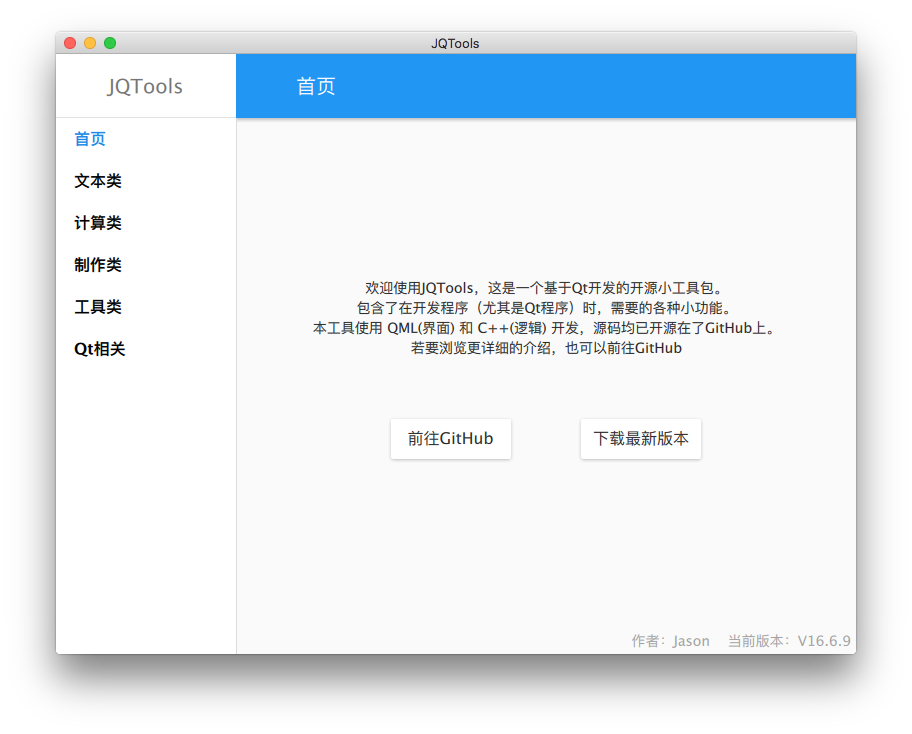

## 介绍

JQTools，为 Jason Qt Tools 的简称

这是一个基于Qt开发的开源小工具包。

包含了在开发程序（尤其是Qt程序）时，需要的各种小功能。

本工具使用 QML(界面) 和 C++(逻辑) 开发，源码均已开源在了GitHub上。

GitHub地址：https://github.com/188080501/JQTools

若不想下载源码编译，也可以点击这里直接下载可执行文件：

https://github.com/188080501/JQTools/releases/latest

若需要其他版本，请下载源码自行编译。

我目前在macOS上，用 Qt5.9.0 配合 Xcode8.3.2，还有在Windows上用 Qt5.9.0 MinGW 版本的成功编译本工程，其他环境不能保证编译的出来，不支持C++14的编译器（比如VS2013）肯定编译不出来。

方便的话，帮我点个星星，或者反馈一下使用意见，这是对我莫大的帮助。

若你遇到问题、有了更好的建议或者想要一些新功能，都可以直接在GitHub上提交Issues：https://github.com/188080501/JQTools/issues

注：局域网相关功能，依赖JQNetwork，这也是我基于Qt开发的一个网络库，GitHub链接如下：
https://github.com/188080501/JQNetwork

## 界面预览

## 开发计划

类别|功能|状态
---|---|---
文本类|UTF16转换|已完成
文本类|RGB转16进制|已完成
文本类|大小写转换|已完成
文本类|密码随机器|已完成
文本类|UUID随机器|已完成
文本类|URL转码|已完成
文本类|JSON格式化|已完成
文本类|字符串排序|已完成
 | |
计算类|HASH计算器|已完成
计算类|Unix时间戳转换|已完成
 | |
制作类|图标生成器|已完成
制作类|图标字体转PNG|已完成
制作类|WebP图片制作器|已完成
制作类|二维码制作器|已完成
制作类|条形码制作器|已完成
 | |
工具类|代码行数统计|已完成
工具类|PNG图片压缩|已完成
工具类|JPG图片压缩|Mac平台已完成
工具类|二维码识别器|已完成
工具类|批量替换|已完成
工具类|屏幕拾色器|已完成
工具类|局域网文件传输|已完成
 | |
Qt相关|PNG警告消除|已完成
Qt相关|Q_PROPERTY生成|已完成
Qt相关|CPP文件生成|已完成
Qt相关|TS文件自动翻译器|等待开发

## 功能介绍
### 文本类

* UTF16转换

	将字符串和UTF-16之间进行互转，例如将 "中文" 和 "\u4E2D\u6587" 互转

* RGB转16进制

	将颜色数值和HEX颜色字符串（例如"#112233"）互转

* 大小写转换

	文本转大写、文本转小写

* 密码随机器

	可以生成随机密码字符串，例如："Hau-eqS-5EC-

* UUID随机器

	可以生成随机密码UUID，例如："bff98ea4-b861-422a-8627-6eb6cbca8716"

* URL转码

	将字符串和编码后的URL之间进行互转，例如将 "中文" 和 "%E4%B8%AD%E6%96%87" 互转

* JSON格式化

	可以将JSON内容进行格式化，可选压缩或者不压缩模式

### 计算类
* HASH计算器

	计算常用的摘要值，如SHA1、MD5

* Unix时间戳转换

	Unix时间戳与日期转换

* 二分法助手

	可以用二分法查找一个有序数组中的某个值

### 制作类
* 图标生成器

	根据已有的PNG图片，生成可以用于发布App的特定分辨率图片，例如OSX的 icon_128x128@2x.png 这样分辨率的图片

* 图标字体转PNG

	将内置的ttf字体转换为PNG，目前一共有5555个图标可供选择

* 二维码生成器

	可以将文本生成二维码图片，并且保存为PNG

* 条形码生成器

	可以将文本生成条形码图片，并且保存为PNG

### 工具类
* 代码行数统计

	可以统计文件中代码行数（'\n'数量）

* PNG图片压缩

	基于Zopfli开发，用于压缩PNG图片，压缩是无损的。

* JPG图片压缩

	基于Guetzli开发，用于压缩JPG图片，压缩是有损的。

* 二维码识别器

	可以将二维码识别成字符串

* 批量替换

	可以批量替换文件名或者文件内容中的特定关键字

* 屏幕拾色器

	可以拾取屏幕中，某个点的颜色

* 局域网文件传输

	可以在局域网中传输文件

### Qt相关
* PNG警告消除

	消除在Qt里，部分PNG图片在加载时控制台会报警告的问题，使用本工具可以将PNG图片进行转换，使用转换后的图片不会在报错

* Q_PROPERTY代码生成

	可以根据Q_PROPERTY的内容，生成代码

* CPP文件生成

	生成CPP文件基本结构

* TS文件自动翻译器

	可以使用百度翻译，自动翻译TS文件并保存翻译结果

## License

See the [LICENSE](LICENSE.txt) file for license rights and limitations (MIT).
